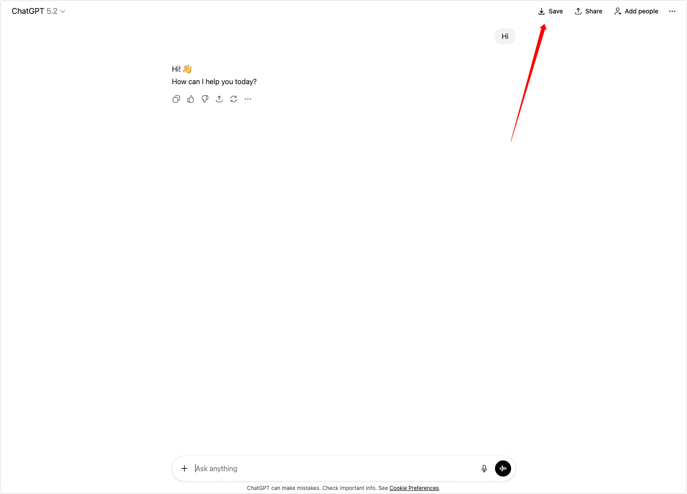

# Chat Saver (Chrome Extension)

[中文版本](README.zh.md)

Save AI chat conversations from popular websites (ChatGPT, Gemini, Claude, etc.) as local Markdown files.



## Overview
Chat Saver is a Chrome extension that lets you save the current chat page into a local Markdown file with one click, making it easy to archive and revisit important conversations.

## Features
- One-click save to Markdown
- Inline Save buttons that match each site’s UI
- Multi-site support (expanding)
- Preserves basic Markdown structure (headings, lists, bold, code blocks)
- **🆕 AI-powered summaries** (optional) - Generate key insights and notable quotes
- **🆕 Smart filenames** - Auto-generated: `{provider}-{topic}-{timestamp}.md`
- Local download only (chat content is not uploaded unless AI summary is enabled)

## Supported Sites
- ChatGPT
- Google Gemini
- Claude
- Grok (still in building)
- DeepSeek (still in building)
- Doubao (still in building)

## Installation (Load Unpacked)
1. Clone this repository
2. Open Chrome and go to `chrome://extensions/`
3. Enable **Developer mode**
4. Click **Load unpacked**
5. Select this project folder

## Usage
1. Open a supported chat page
2. Find the `Save` button in the page header actions
3. Click to download the Markdown file

### Enable AI Summary (Optional)
1. Right-click the extension icon and select "Options" (or click ⚙️ Settings in the popup)
2. Toggle "Enable AI Summary"
3. Select your preferred AI provider (OpenAI, Anthropic, or Google Gemini)
4. Enter your API key
5. Save settings

When enabled, saved chats will include:
- 💡 Key Insights (2-4 bullet points)
- ✨ Notable Quotes (1-3 memorable quotes)
- 📋 Summary (2-3 sentence overview)

## Export Format
The exported `.md` file includes:
- Conversation title (if available)
- `# USER` / `# ASSISTANT` as top-level headings
- Lists, bold text, code blocks, and other common Markdown structures
- Canvas entries include title/time metadata when only the chip is available

## Privacy
- **Without AI Summary**: All processing is local. The extension does not upload your chats.
- **With AI Summary**: When enabled, conversation content is sent to your chosen AI provider (OpenAI/Anthropic/Google) to generate summaries. Your API key is stored locally and never shared.

## Known Limitations
- Only currently loaded messages are saved
- Some rich formatting may be lost depending on site markup
- Gemini Canvas content may be unavailable if the page only exposes a chip/card

## Development
No build step yet. Use `src/extension` directly as the extension source.

## Project Structure
```
src/extension/
  manifest.json
  content-script.js
  service-worker.js
  popup.html / popup.js / popup.css
  options.html / options.js        # Settings page for AI summary
  lib/
    ai-summary.js                  # AI summary service
    filenames.js                   # Smart filename generation
    markdown.js                    # Markdown rendering
    extractors/                    # Site-specific extractors
```

## Roadmap
- Add more site support
- Improve rich content and attachments export
- Optional cloud sync (future)
- Custom summary prompts
- Local LLM support (Ollama)
